## Question 1
What are the server hardware specifications (virtual machine settings)? Take a screenshot - don’t type it!
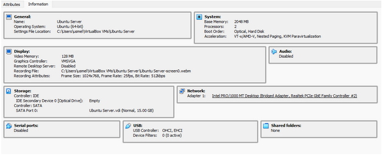

## Question 2
What is Ubuntu server log in screen? Take screenshot - do not type it!
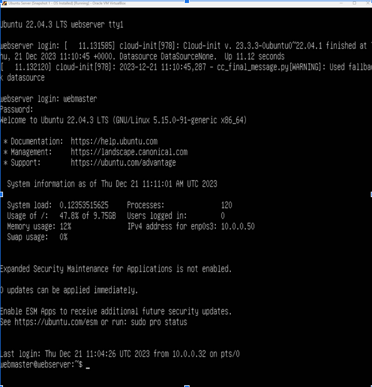

## Question 3
What is the IP address of your Ubuntu Server Virtual Machine?

***10.0.0.50***
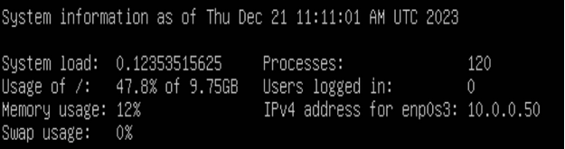

## Question 4
How do you enable the Ubuntu Firewall?

***Use command: Sudo ufw enable*** 

## Question 5
How do you check if the Ubuntu Firewall is running?
***Use command: sudo ufw status***
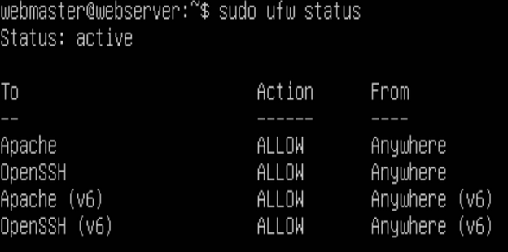
## Question 6
How do you disable the Ubuntu Firewall?
***Sudo ufw diable***
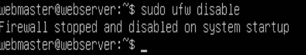

## Question 7
How do you add Apache to the Firewall?
***Sudo ufw allow ‘Apache’***
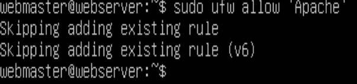
## Question 8
What is the command you used to install Apache?
***sudo apt install apache2 -y***
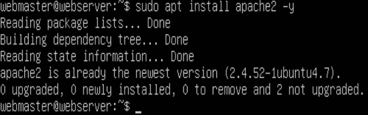
## Question 9
What is the command you use to check if Apache is running?
***Sudo systemctl status apache2 –no-pager***
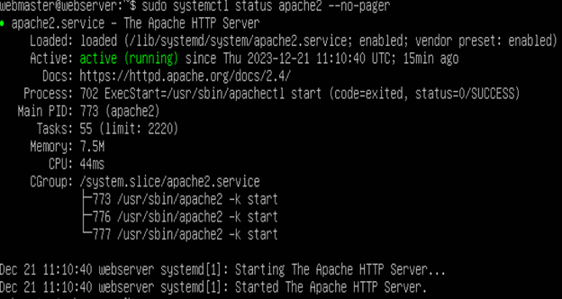
## Question 10
What is the command you use to stop Apache?
***sudo systemctl stop apache2***
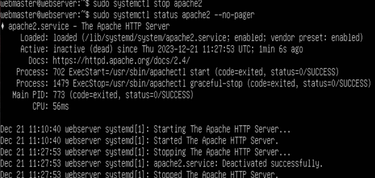
## Question 11
What is the command you use to restart Apache?
***Sudo systemctl restart apache2***
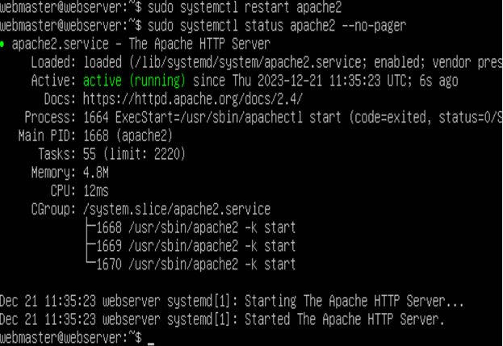
## Question 12
What is the command used to test Apache configuration?
***sudo apache2ctl configtest***
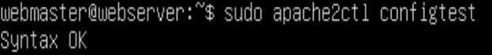
## Question 13
What is the command used to check the installed version of Apache?
***Apache2 -v***
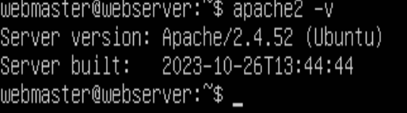
## Question 14
What are the most common commands to troubleshoot Apache errors? Provide a brief description of each command.
***Systemctl- Is used to control the service***

***Journalctl- Is used to view the logs generated by systemd***

***Apachectl- Is used to check Apache’s configuration***

## Question 15
Which are Apache Log Files, and what are they used for? Provide examples and screenshots.

***They are files that record everything the Apache web server is doing and they are split into two different text files such as Access log and error log . They are used for analysis by the server administrator.***

***Access Log:
You use command: sudo tail -f /var/log/apache2/access.log***
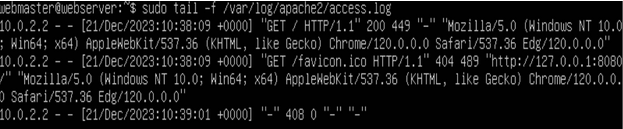
***Error Log:
Use command:  sudo tail -f /var/log/apache2/error.log***
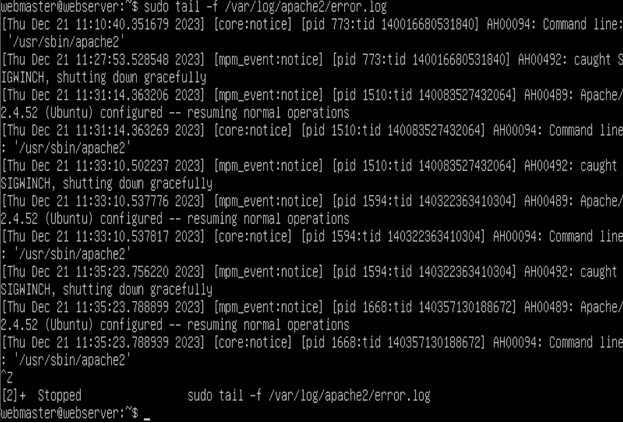

