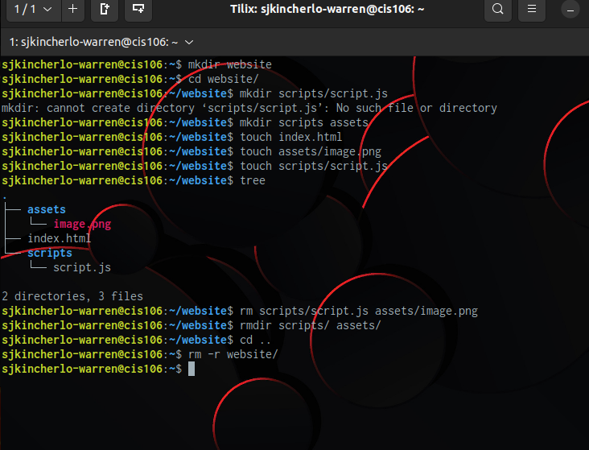
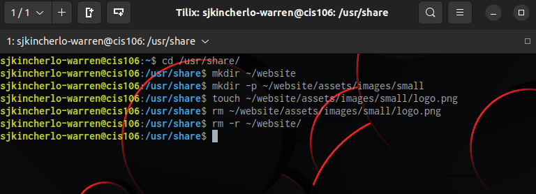
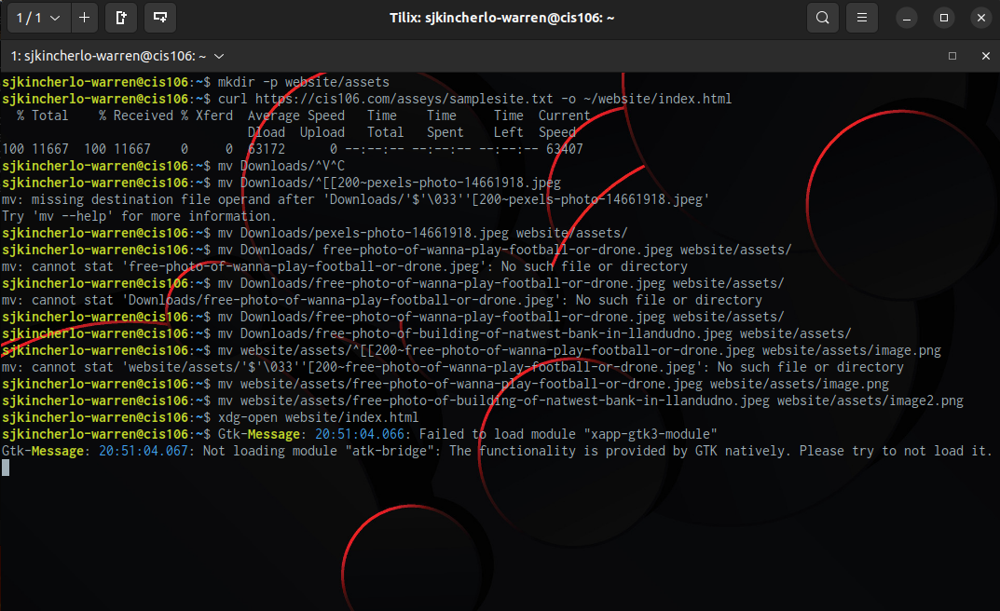
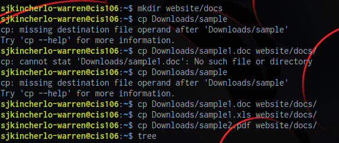
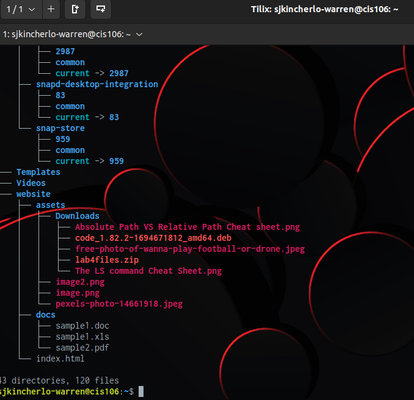

# Week Report 5

## Answer to Questions:

* **What are Command Options?** 
Varies of different actions for a single command

* **What are Command Arguments?** 
extra commands you use when launching a program so the function will change

* **Which command is used for creating directories? Provide at least 3 examples.**
Using the "mkdir" command. mkdir "Directory-name", mkdir /home/USER/Pictures/"NameofNewDirectory", mkdir -p video/vacation/island

* **What does the touch command do? Provide at least 3 examples.**
It creates files. touch hw1.txt, touch car.txt, touch band.txt

* **How do you remove a file? Provide an example.**
Using the "rm" command. rm classnotes5.txt
* **how do you remove a directory and can you remove non-empty directories in Linux?**Provide an example
Use the "rm" command. You can remove non-empty directories by typing "rm -r directory-name" 
* **Explain the mv and cp command. Provide at least 2 examples of each**
the mv command can move files, directories and rename. The cp command can copy files and or directories. mv Downloads/bike.png /Pictures, mv bike.txt motorcycle.txt. cp Downloads/audi R8.png  /Pictures, cp -r ~/Downloads/FirstPersonShooter.mp3 ~/Music/

## Practice 1
 
## Practice 2
 
## Practice 3
 
## Practice 4
 
 
