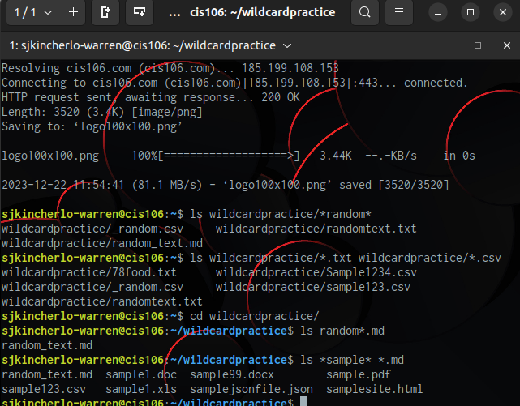
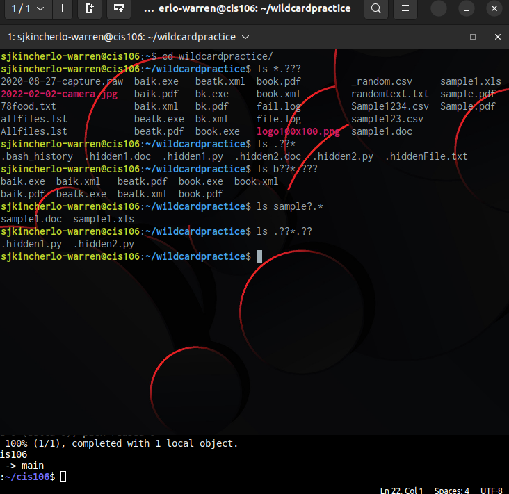
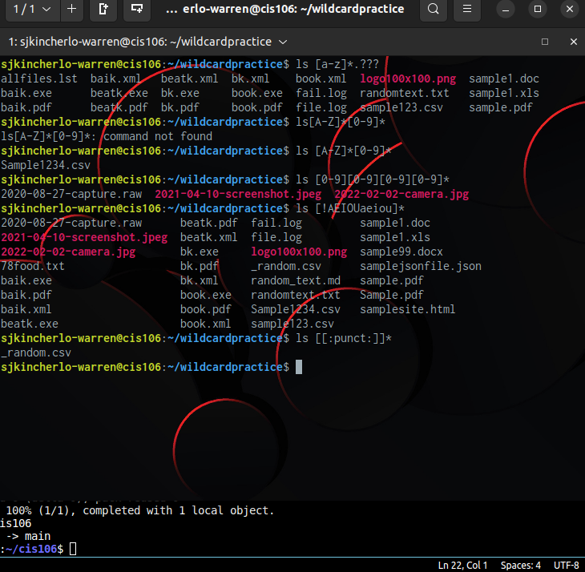

# Week Report 6

## Wildcards "*"
This wildcard replaces the name of the files
Ex: ls -l *.css
ls *.py 
ls .csv*.exe

### Wildcards "?"
This wildcard matches precisely one character
Ex: ls .??*??
ls .??*
ls *.???  

#### Wildcards []
This wildcard will match a single character in range
Ex:
ls f[aeiou]*
ls *[0-9]
ls f[a-z]*
## Practice 5

## Practice 6

## Practice 7
