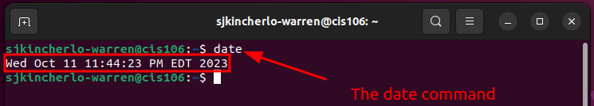
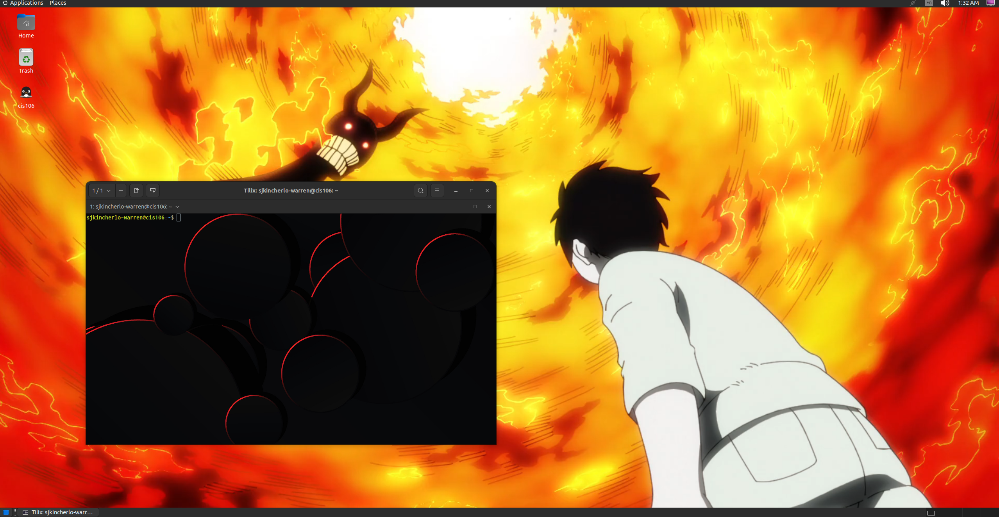

#Lab Submission

## Question 1

## Question 2

## Question 3

| Program purpose     | Package Name                | Version |
| ------------------- | --------------------------- | ------- |
| Play a tetris game  | Block attack                | 2.7.0.1 |
| Play a video file   | Dragon Player               | 5.92.0  |
| Browse the internet | epiphany-browser            | 42.4    |
| Read your email     | Geary                       | 40.0    |
| Play music          | LXMusic simple music player | 0.4.7   |

## Question 4
| command                                                        | what it does                                                                                                                                        |
| -------------------------------------------------------------- | --------------------------------------------------------------------------------------------------------------------------------------------------- |
| echo                                                           | displays a line of text                                                                                                                             |
| fortune                                                        | prints out a random epigram                                                                                                                         |
| cowsay                                                         | enerates  an ASCII picture of a cow saying something provided by the user                                                                           |
| lolcat                                                         | is a program that concatenates files, or standard input, to standard output (like the generic cat), and adds rainbow coloring to it.                |
| figlet                                                         | prints its input using large characters (called ``FIGcharacters'')made up of ordinary screen characters (called ``sub-characters'').                |
| toilet                                                         | prints text using large characters made of smaller characters                                                                                       |
| rig                                                            | is  a  utility that will piece together a random first name, last name, street number and address, along with a geographically consistant (ie, they all match the same area) city, state, ZIP code, and area code. |